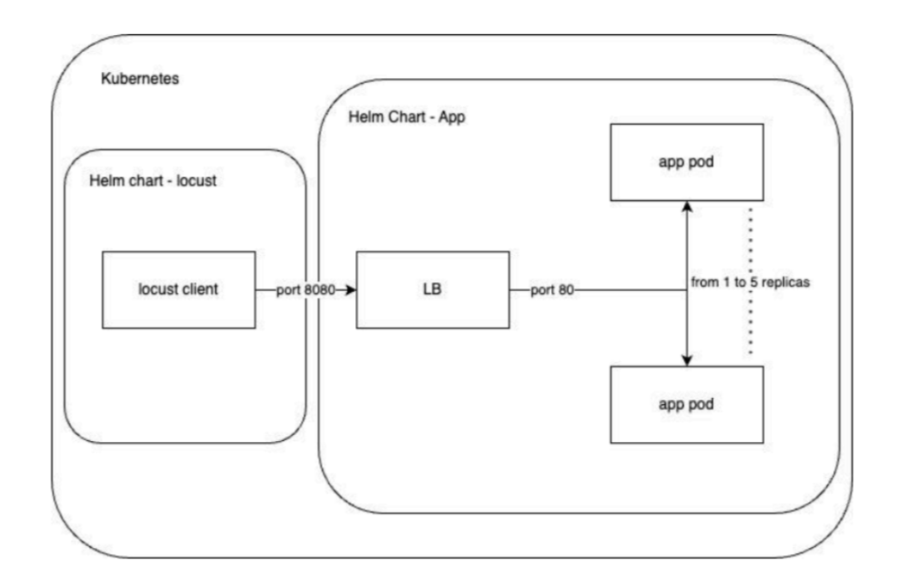

# Temp-Conversion-DevOps

## Table of contents: 
* [General info](#general-info)
* [Project structure](#project-structure)
* [Steps and used technologies](#steps-and-used-technologies)
* [Requirements](#requirements)
* [Setup](#setup)

### General info
The aim of this project is to create a comprehensive environment for a web application based on DevOps principles.
### Project structure
### Project architecture 

### Steps and used technologies
1. Creation of backend server that uses HTTP protocol and response with calculated Celsius temperature based on Fahrenheit temperature -> Python 3.11+, Flask
2. Creation of a docker image to run the application and push it to public repository on DockerHub: [Temp-conversion-flask-app](https://hub.docker.com/repository/docker/natix02/temp-convert-flask-app/general)
3. Creation of a helm chart to deploy the app in the Kubernetes (k8s) environment. A locally hosted Minikube was used for that purpose.
4. Usage of a locust as a client for my app. Building a [docker image](https://hub.docker.com/repository/docker/natix02/temp-conversion-load-test/general) and a helm chart to run a performance test at the k8s cluster. Running the client for 5 minutes.
Testing parameters are shown below:
Got the statistics files from testing in cvs format and attach them to [results directory](results)
5. Using TensorFlow Serving served a computational graph converting Fahrenheit temperature to Celsius. The graph in a TF SavedModel format is provided [here](tensorflow_model). Push created locally DockerImage into [DockerHub](https://hub.docker.com/repository/docker/natix02/tensor-flow-model-temp-convert/general)
6. 
### Requirements
docker, Minikube
### Setup
If you are Apple macOS or Microsoft Windows user make sure you have Docker Desktop installed and engine running.  
1. First, clone this repository:
   ```sh
   git clone https://github.com/natix-x/Temp-Conversion-DevOps.git
   ```
2. For starting your kubernetes cluster
    ```sh
   minikube start
   ```
3. For creating app helm chart go to k8s//app and:
    ```sh
   helm install app .
   ```
4. For running test using locust as a client go to k8s//locust:
   * install locust helm chart
       ```sh
      helm install locust .
       ```
   * get pods names
      ```sh
      kubectl get pods
      ```
   * get app address
      ```sh
      kubectl logs [app-pod-id]
      ```
   * get locust url 
      ```sh
      minikube service my-locust --url
      ```
    And on that url you can run your own tests by setting parameters you want and inserting host as app address from previous step.
5. If you are done working with app or locust just uninstall used helm charts:
    ```sh
      kubectl uninstall app
      kubectl uninstall locust
      ```
